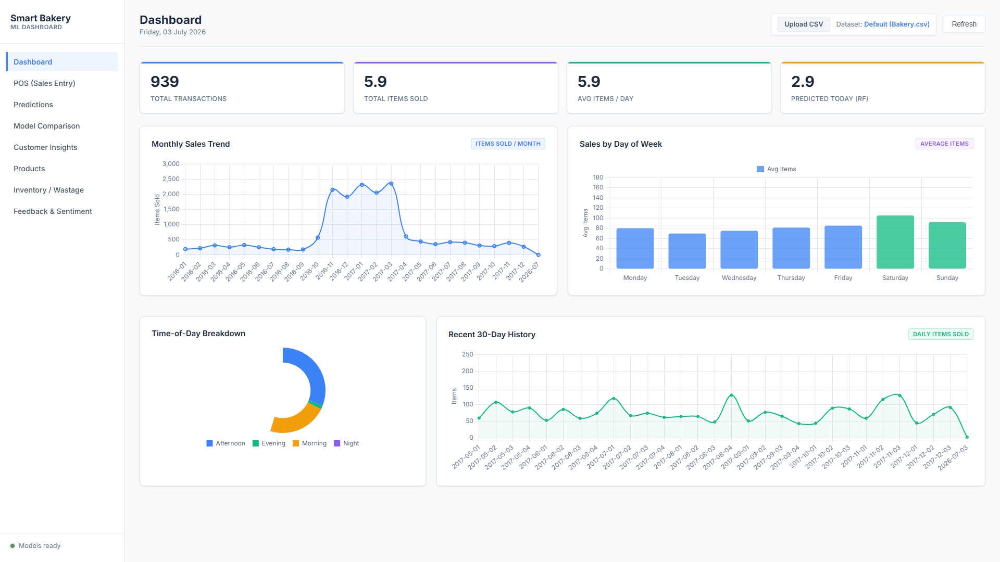
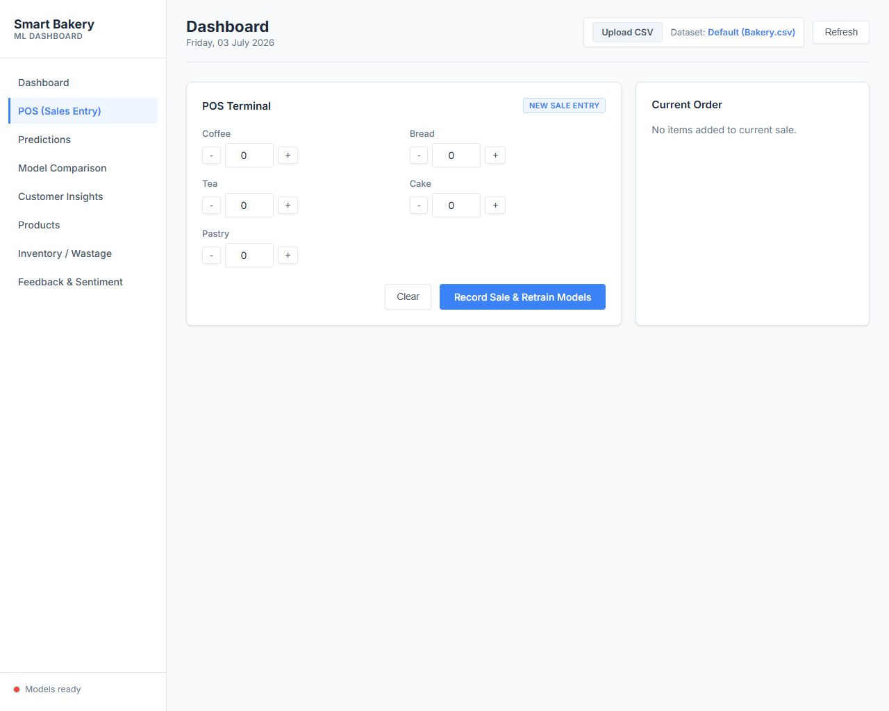
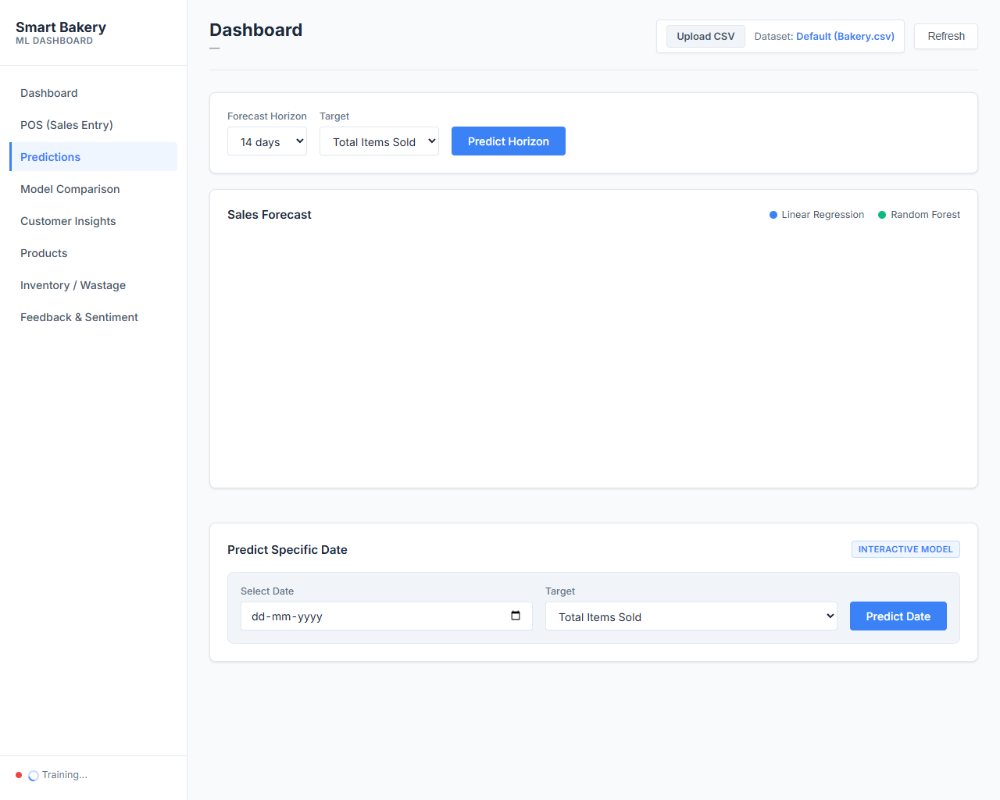
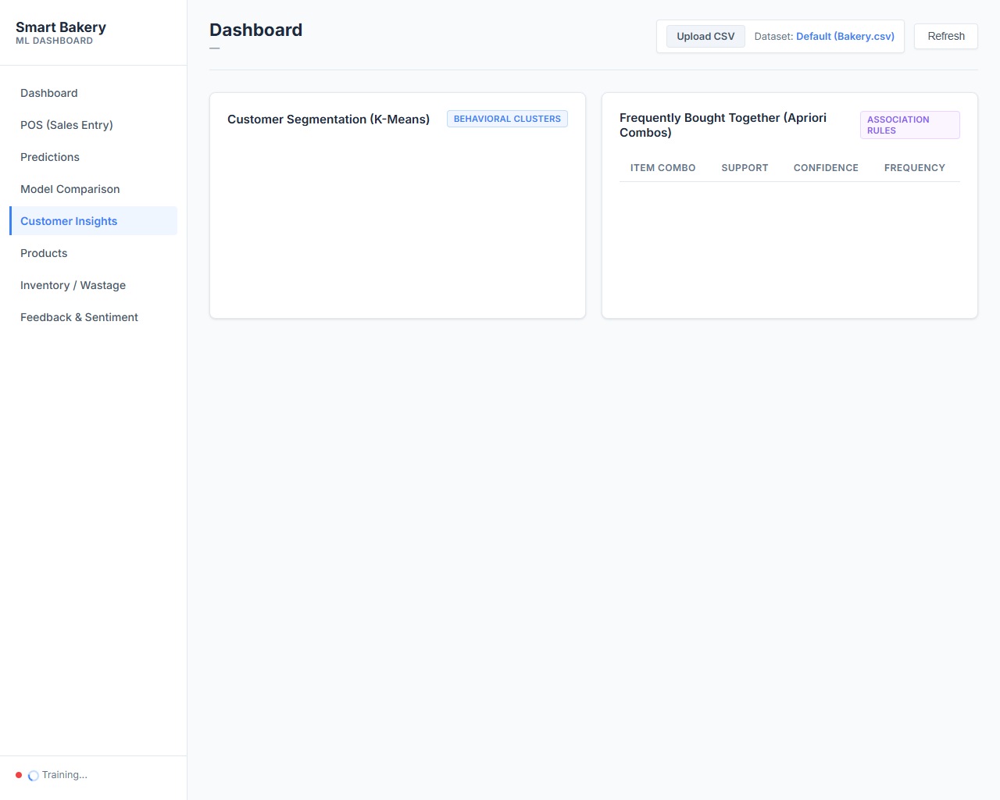
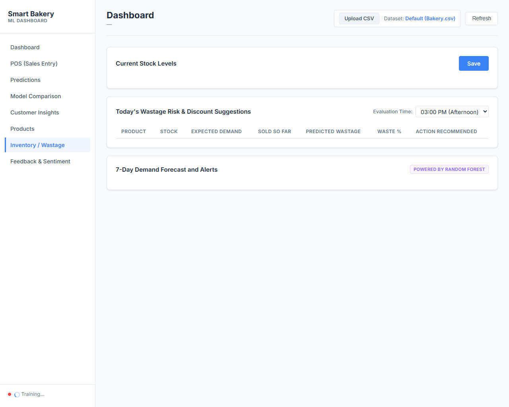
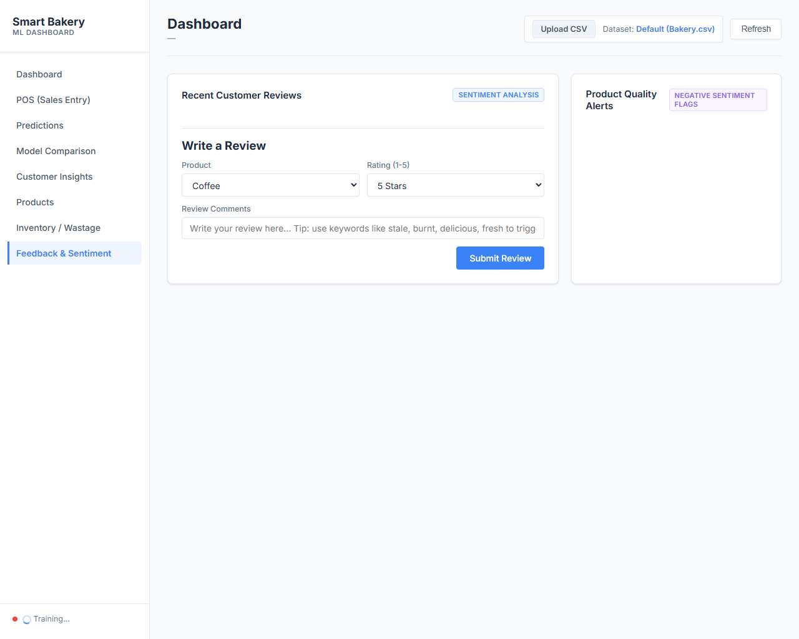

# Smart Bakery Management System with ML

An intelligence platform that helps bakeries predict demand, optimize inventory stock levels, minimize product wastage, analyze customer purchase patterns, and review feedback sentiment.

---

## Table of Contents
1. [Prerequisites](#1-prerequisites)
2. [Step-by-Step Installation](#2-step-by-step-installation)
3. [Running the Application](#3-running-the-application)
4. [Dashboard Features](#4-dashboard-features)
5. [Codebase Architecture](#5-codebase-architecture)

---

## 1. Prerequisites

### Step A: Install Git
Git allows you to download and manage the code repository.
* **Download:** Visit [git-scm.com/downloads](https://git-scm.com/downloads) and select the **Windows** version.
* **Installation:** Run the installer and click **Next** through the setup prompts, leaving all configurations at their defaults.
* **Verification:** Open your Command Prompt (`cmd.exe`), type `git --version`, and press Enter.

### Step B: Install Python
Python runs the machine learning engine and the web server.
* **Download:** Visit [python.org/downloads](https://www.python.org/downloads/) and choose the **Windows** installer.
* **Installation:** Open the installer file.
* **IMPORTANT WARNING:** You must check the checkbox labeled **"Add python.exe to PATH"** at the bottom of the installer window. If you do not check this, Windows will fail to run Python commands.
* **Verification:** Open a fresh Command Prompt (`cmd.exe`), type `python --version`, and press Enter.

---

## 2. Step-by-Step Installation

### Step 1: Clone the Codebase
Open the Command Prompt and navigate to your Desktop, then clone the repository:
```bash
cd Desktop
git clone https://github.com/efx-suresh7/smart_bakery_ml.git
cd smart_bakery_ml
```

### Step 2: Set Up Virtual Environment
Isolate the project packages from other software on your system:
```bash
python -m venv .venv
```

Activate the environment based on your operating system:
* **Windows Command Prompt:**
  ```bash
  .venv\Scripts\activate
  ```
* **macOS / Linux Terminal:**
  ```bash
  source .venv/bin/activate
  ```
*Note: Your command line prompt will now show `(.venv)` at the beginning, confirming it is active.*

### Step 3: Install Required Libraries
Download all package dependencies specified in the requirements file:
```bash
pip install -r requirements.txt
```

---

## 3. Running the Application

### Launch the Flask Web Server
To start the application, run:
```bash
python app.py
```

Upon successful startup, the console will print out the server bootstrap logs:
```text
=======================================================
  Smart Bakery Management System
  Data: Bakery.csv (real transactions)
  Models: Linear Regression + Random Forest
  URL: http://127.0.0.1:5000
=======================================================
 * Running on http://127.0.0.1:5000 (Press CTRL+C to quit)
```

### Open the Dashboard
Open your web browser of choice (Chrome, Edge, Firefox) and navigate to:
**[http://127.0.0.1:5000](http://127.0.0.1:5000)**

---

## 4. Visual Walkthrough & Features

### Dashboard Overview
Displays overall transaction counters, average items sold per day, and historical trend lines.


### POS Terminal (Sales Entry)
Enter items sold in real-time. Submitting a sale appends it directly to the active CSV file and automatically retrains the machine learning models.


### Demand Predictor
Interactive forecasts showing predicted daily sales for the next 7, 14, or 30 days. Includes a date picker to predict demand for any specific date.


### Customer Insights (Segmentation & Combos)
Visual representation of customer groups using **K-Means Clustering** and frequently purchased combos mined via **Apriori-style association analysis**.


### Inventory & Wastage
Evaluates current stock against expected end-of-day demand and alerts you of potential wastage, recommending discount percentages to clear inventory.


### Feedback & Sentiment
Analyze reviews left by customers. System flags products with high negative feedback and displays extracted issue words (like "stale", "dry", or "burnt").


---

## 5. Codebase Architecture

| File / Folder | Purpose |
| :--- | :--- |
| `app.py` | Web server code managing API endpoints (POS logging, reviews, wastage, predictions). |
| `ml_models.py` | ML algorithms (Linear Regression, Random Forest, K-Means clustering, Apriori mining). |
| `data_loader.py` | Pre-processes transaction logs and constructs date-specific features. |
| `Bakery.csv` | Standard daily transaction history file. |
| `requirements.txt` | Package versions required to execute the models. |
| `templates/` | Main index HTML layout. |
| `static/` | Stylesheet styling rules and ChartJS controllers. |
| `uploads/` | Save location for uploaded custom CSV files. |
